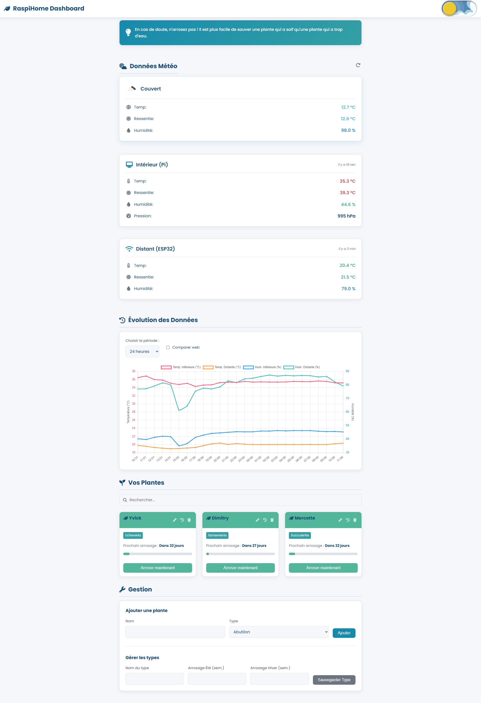
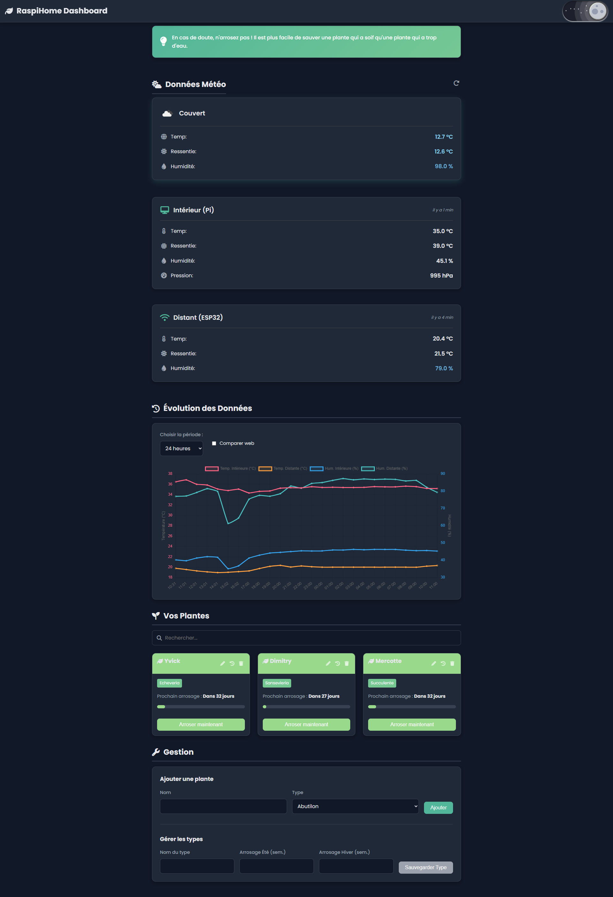

# RaspiHome Hub v1.4 : Météo Multi-Capteurs, Jardinage Intelligent et Protection Réseau

<p align="center">
  
</p>

**RaspiHome Hub** transforme votre Raspberry Pi en un serveur domestique complet. Cette version majeure intègre une **station météo multi-sources** (capteur local, capteur distant via ESP32, et API web), un **assistant de jardinage proactif** avec suivi visuel, et une **interface graphique entièrement interactive**, tout en gardant la possibilité de protéger votre réseau avec AdGuard Home.

## Table des Matières

* [Fonctionnalités Clés](#fonctionnalités-clés)
* [Aperçu de l'Interface](#aperçu-de-linterface)
* [Architecture Technique v3.0](#architecture-technique-v30)
* [Prérequis](#prérequis)
* [Installation Facile](#installation-facile)
* [Guide d'Utilisation](#guide-dutilisation)
* [Structure du Projet](#structure-du-projet)
* [Personnalisation](#personnalisation)
* [Feuille de Route et Idées Futures](#feuille-de-route-et-idées-futures)
* [Licence](#licence)

---

## Fonctionnalités Clés

### Station Météo & Jardinage Intelligent

* 📡 **Dashboard Météo Multi-Sources** : Affiche la température, l'humidité, la pression et l'indice de chaleur calculé selon la formule de la NOAA provenant de **3 sources** :
    * **Capteur Local** (Sense HAT sur le Pi).
    * **Capteur Distant** (ESP32 via WiFi).
    * **API Météo Web** (OpenWeatherMap, si configurée).
* 🔄 **Rafraîchissement à la Demande** : Le bouton "Rafraîchir" envoie un ordre à l'ESP32 et au Sense HAT pour forcer une nouvelle lecture immédiate.
* 🎨 **Données Visuelles Claires** :
    * Les cartes affichent l'heure de la dernière mesure (ex: "il y a 2 min").
    * Les valeurs de température et d'humidité **changent de couleur** (bleu/froid, rouge/chaud) pour une lecture rapide.
* 📈 **Graphiques Interactifs Avancés** :
    * **Zoom et Panoramique** : Zoomez avec la molette ou en pinçant (mobile) et déplacez-vous sur l'axe du temps. Un bouton "Reset Zoom" apparaît.
    * **Affichage des Points** : De petits points sont visibles sur les courbes pour identifier les mesures.
    * **Lignes de Seuil** : Affiche la plage de "Température Idéale" (18-25°C) directement sur le graphique.
    * **Zones Nuit/Jour** : (Vue 24h) Affiche des zones grisées pour les heures de nuit, basées sur le lever/coucher du soleil de votre localisation.
    * **Comparaison Visuelle** : Une case à cocher permet de superposer la température de la météo web sur le graphique.
* 🌗 **Thème Clair & Sombre** : Basculez entre deux thèmes visuels. Le choix est mémorisé.
* 💧 **Assistant de Jardinage Proactif** :
    * **Base de Données SQLite** : Gère les plantes, les types de plantes, et l'historique d'arrosage.
    * **Suivi Visuel** : Une **barre de progression** sur chaque carte de plante montre l'état du cycle d'arrosage.
    * **Gestion Complète via l'Interface** :
        * Ajoutez, recherchez et supprimez vos plantes.
        * Cliquez sur "Modifier" pour changer le **Nom**, le **Type** ET les **intervalles d'arrosage (semaines été/hiver)** directement depuis l'interface.
    * **Notifications Telegram** : Envoie une alerte Telegram lorsque des plantes ont besoin d'eau.
* 🧩 **Code JavaScript Modulaire** : Le code frontend est éclaté en modules (`api.js`, `ui.js`, `main.js`) pour une meilleure maintenabilité.
* ⚙️ **Déploiement en tant que Service** : Le serveur Flask tourne en continu grâce à un service `systemd`, garantissant un lancement automatique et un redémarrage en cas de crash.

### Protection Réseau avec AdGuard Home (Optionnelle)
*   ⛔ **Blocage des Publicités et Traqueurs** : Filtre le contenu indésirable sur tous les appareils de votre réseau.
*   🕵️ **Surveillance du Trafic** : Accédez à un tableau de bord détaillé pour voir les requêtes DNS.
*   🔒 **Sécurité Améliorée** : Protège contre les sites de phishing et de logiciels malveillants.

---

## Aperçu de l'Interface

L'interface a été entièrement repensée pour être plus claire, plus esthétique et plus fonctionnelle.

| Thème Clair | Thème Sombre |
| :---: | :---: |
|  |  |
---

## Architecture Technique v3.0

L'architecture a été revue pour intégrer des capteurs distants et une interactivité accrue.

1.  **Sources de Données** :
    * **Capteur Local (Sense HAT)** : Données intérieures du Pi.
    * **Capteur Distant (ESP32)** : Un ESP32 avec capteur DHT envoie ses données à la route `/esp32/data` et écoute les ordres sur `/read_sensor`.
    * **API OpenWeatherMap** : Données météo extérieures (si configurée).
2.  **Script Python (`serveur_temp.py`)** :
    * **Serveur Web (Flask)** : Expose de multiples routes API (`/alldata`, `/history`, `/plants`, `/config_data`, etc.).
    * **Serveur de Commande** : Expose la route `/trigger_read` pour commander l'ESP32.
    * **Calcul des Zones Nuit/Jour** : Utilise `python3-astral` pour calculer le lever/coucher du soleil et l'envoyer au graphique via `/config_data`.
3.  **Stockage Centralisé (SQLite)** :
    * **`raspihome.db`** : Stocke tout : `plants`, `plant_rules`, `watering_history` et `sensor_readings` (avec les nouvelles colonnes `int_temp`, `ext_temp`, `int_hum`, `ext_hum`).
4.  **Interface Utilisateur (Modulaire)** :
    * `index.html` + `style.css`.
    * Logique JS (`api.js`, `ui.js`, `main.js`).
    * **Chart.js** avec les plugins `chartjs-plugin-zoom` et `chartjs-plugin-annotation` pour l'interactivité.

---

## Prérequis

### Matériel

* Un Raspberry Pi (testé sur un modèle 1 B+)
* Une carte d'extension [Sense HAT](https://www.raspberrypi.com/products/sense-hat/)
* **(Optionnel) Un ESP32** (ou ESP8266) et un capteur DHT11/22.
* Une alimentation fiable et une carte microSD.

### Logiciel

* Python 3.x et Git.
* Un compte et une **clé d'API** du service [OpenWeatherMap](https://openweathermap.org/) (Gratuit, optionnel mais recommandé).
* Les bibliothèques Python (Flask, Requests, etc.).
* Les bibliothèques système `python3-sense-hat` et `python3-astral`.

---

## Installation Facile

### Étape 1 : Installation de la Station Météo

1.  **Mettre à jour le système** :
    ```bash
    sudo apt update && sudo apt upgrade -y
    ```
2.  **Cloner ce dépôt** :
    ```bash
    git clone [https://github.com/PlonoXxcoder/RaspiHome-Hub.git](https://github.com/PlonoXxcoder/RaspiHome-Hub.git)
    cd RaspiHome-Hub
    ```
3.  **Installer les dépendances système et Python** :
    ```bash
    # Installer les dépendances système (Sense HAT, Astral, Requests)
    sudo apt-get install python3-sense-hat python3-astral python3-requests
    # Installer les autres dépendances (Flask, etc.)
    sudo pip3 install -r requirements.txt
    ```
4.  **Initialiser la base de données** :
    ```bash
    python3 database_setup.py
    ```
5.  **Configurer (Optionnel)** :
    Éditez `config.py` pour ajouter vos clés API (OpenWeather, Telegram) et vos coordonnées (Latitude, Longitude).

### Étape 2 : Installation d'AdGuard Home

*(Suivez le guide officiel d'AdGuard Home)*

---

## Guide d'Utilisation

### Démarrage du Serveur

Il est fortement recommandé d'utiliser le service `systemd` fourni.

1.  **Copier le fichier de service** :
    ```bash
    sudo cp raspihome.service /etc/systemd/system/raspihome.service
    ```
2.  **Mettre à jour le chemin dans le service** (si nécessaire) :
    * Éditez le fichier : `sudo nano /etc/systemd/system/raspihome.service`
    * Vérifiez que les lignes `WorkingDirectory` et `ExecStart` pointent bien vers `/home/paul/RaspiHome-Hub` (ou votre chemin).
3.  **Lancer et activer le service** :
    ```bash
    sudo systemctl daemon-reload
    sudo systemctl start raspihome.service
    sudo systemctl enable raspihome.service # Pour le lancer au démarrage
    ```
4.  **Accéder à l'interface** : `http://<VOTRE_ADRESSE_IP>:5000`
5.  **Voir les logs** : `journalctl -u raspihome.service -f`

---

## Structure du Projet

## Structure du Projet
```
RaspiHome-Hub/
├── templates/
│   ├── api.js
│   ├── ui.js
│   ├── main.js
│   ├── index.html
│   └── style.css
├── esp32_firmware/      
│   └── esp_client.ino   
├── assets/
├── config.py
├── database_setup.py
├── raspihome.service
├── requirements.txt
├── serveur_temp.py
└── README.md
```
---

## Personnalisation

* **Configuration Principale** : Éditez `config.py` pour vos clés API, coordonnées et jetons Telegram.
* **Seuils du Graphique** : Modifiez les seuils de température (`TEMP_IDEAL_MIN`, `TEMP_IDEAL_MAX`) directement dans `serveur_temp.py` (ou déplacez-les dans `config.py`).
* **Règles d'Arrosage** : N'éditez plus les fichiers ! Utilisez la section "Gestion" -> "Gérer les types" directement sur l'interface web.

---

### Feuille de Route et Idées Futures

Ce projet a un grand potentiel d'évolution. Voici ce qui est prévu et ce qui pourrait être imaginé.

### 🚀 Prochaines Étapes (Feuille de Route)

Voici les fonctionnalités sur lesquelles nous travaillons activement pour les prochaines versions :

- **[✅] v1.1 : Améliorations de l'Interface et des données**
    - [X] Rendre les graphiques plus interactifs (zoom, info-bulles au survol).
    - [X] Ajouter un bouton "Rafraîchir maintenant" pour les données en temps réel.
    - [X] Afficher un indicateur visuel clair (ex: une icône de goutte d'eau) à côté des plantes qui ont besoin d'être arrosées.
    - [X] Ajouter une fonction de suppression de plante directement depuis l'interface.
    - [X] Migrer l'historique météo (data.csv) vers la base de données SQLite pour des performances accrues.
          
  
- **[✅] v1.2 : Notifications Avancées**
    - [X] Mettre en place un système de notifications par email ou via un bot Telegram pour les alertes critiques (plante à arroser, température trop haute/basse).
    - [ ] Permettre de configurer des seuils d'alerte pour la température et l'humidité.

- **[ ] v1.3 : Gestion des Plantes via l'UI**
    - [X] Créer un formulaire dans l'interface web pour ajouter, modifier ou supprimer une plante sans avoir à éditer le fichier `plants.json` manuellement.
    - [X] Ajouter d'autres Raspberry ou Esp-32 afin de terminer chaque température et pression de chaque piece de la maison/appartement.
    - [X] Controler l'humidité de la salle de bain afin de controller l'ouverture des fenetres pour l'aération

- **[✅ ] v1.4 : Hub IoT & Visualisation Avancée**
   - [X] **Intégration Capteur Distant** (ESP32) avec rafraîchissement à la demande.
   - [X] **Graphiques Interactifs** (Zoom, Pan, Points, Seuils, Zones Nuit/Jour).
   - [X] **Comparaison Météo Web** sur le graphique.
   - [X] **Barre de Progression** d'arrosage pour les plantes.
   - [X] **Mode Édition Avancé** (Correction du layout + modification des intervalles d'arrosage).
   - [X] **Affichage "Dernière MàJ"** et codes couleurs sur les cartes météo.
   - [X] Migration de la DB vers un schéma `int_`/`ext_`.
   - [ ]** Déploiement Fiable** : Remplacement du lancement manuel par un service systemd avec redémarrage automatique.

### 🚀 Prochaines Étapes
- [ ] **Alertes Météo avancées ** : Notifications Telegram pour seuils de température/humidité critiques (côté serveur), en cas de dépassement (ex: "Alerte : Température intérieure trop élevée !").
- [ ] **Page Historique Détaillée** : Créer une nouvelle page avec un sélecteur de dates (calendrier), un tableau de données triable et un bouton d'export CSV.
- [ ] **Indicateurs Visuels** : Remplacer les pourcentages d'humidité par des **jauges circulaires** et ajouter des mini-graphiques "sparklines" dans les cartes météo.
- [ ] **Contrôle Salle de Bain** : Objectif d'ajouter un capteur dans la SDB pour contrôler l'aération.

### 💡 Idées pour l'Avenir
* **Capteurs d'Humidité du Sol** : L'évolution logique. Utiliser des capteurs capacitifs pour baser l'arrosage sur le besoin réel.
* **Arrosage Automatique** : Connecter une pompe et un relais à l'ESP32 pour un arrosage 100% autonome.
* **Support Multi-Capteurs** : Permettre d'ajouter *plusieurs* capteurs ESP32 (ex: un par pièce) et de les afficher sur le dashboard.

---

## Licence

Ce projet est distribué sous la licence MIT.
