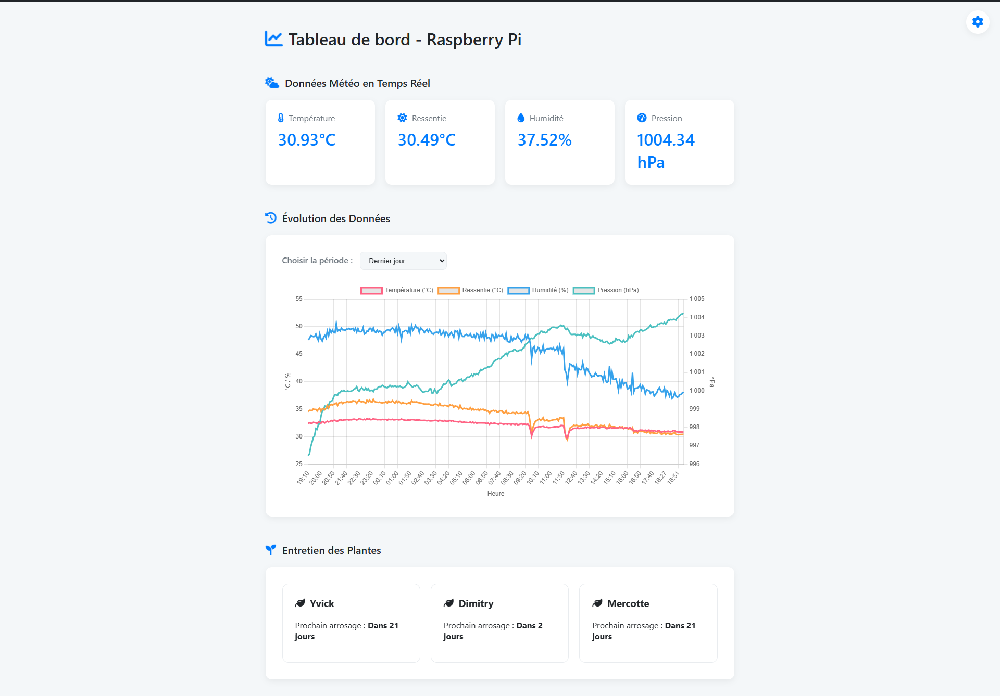
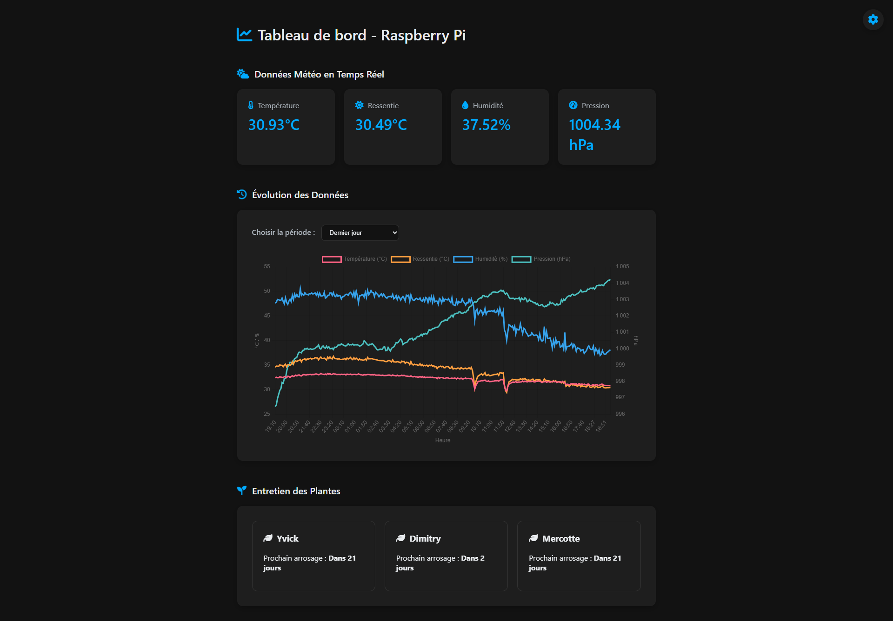

# RaspiWeatherPlant : Station Météo & Gardien de Plantes sur Raspberry Pi


**RaspiWeatherPlant** transforme votre Raspberry Pi équipé d'un Sense HAT en un centre de contrôle environnemental intelligent. Ce projet offre une station météo complète accessible via une interface web et un assistant de jardinage proactif qui vous rappelle quand arroser vos plantes grâce à des alertes visuelles sur la matrice LED.

## Table des Matières
- [Fonctionnalités Clés](#fonctionnalités-clés)
- [Aperçu de l'Interface](#aperçu-de-linterface)
- [Architecture Technique](#architecture-technique)
- [Prérequis](#prérequis)
- [Installation Facile](#installation-facile)
- [Guide d'Utilisation](#guide-dutilisation)
- [Structure du Projet](#structure-du-projet)
- [Personnalisation Avancée](#personnalisation-avancée)
- [Feuille de Route et Idées Futures](#feuille-de-route-et-idées-futures)
- [Contribuer](#contribuer)
- [Licence](#licence)

## Fonctionnalités Clés

*   📊 **Dashboard Météo en Temps Réel** : Affiche la température, l'humidité, la pression et un **indice de chaleur** calculé selon la formule de la NOAA.
*   📈 **Historique des Données** : Visualisez des graphiques dynamiques de l'évolution des conditions sur différentes périodes : heure, 12 heures, jour, semaine, mois et année.
*   🌗 **Thème Clair & Sombre** : Basculez entre deux thèmes visuels pour un confort de lecture optimal, de jour comme de nuit. Le choix est mémorisé.
*   💧 **Assistant de Jardinage Intelligent** :
    *   Définit des cycles d'arrosage personnalisés pour chaque plante, avec des intervalles différents pour l'été et l'hiver.
    *   Génère des **alertes visuelles** sur la matrice LED du Sense HAT lorsqu'une plante a soif.
    *   Permet de confirmer l'arrosage via l'interface web ou directement avec le **joystick du Sense HAT**.
*   🌐 **Interface Web Intuitive** : Une application web légère et responsive construite avec Flask pour un accès facile depuis n'importe quel appareil sur votre réseau local.
*   ⚙️ **Fonctionnement Autonome** : Le script utilise des threads pour enregistrer les données et gérer les alertes en arrière-plan, sans interrompre le serveur web.

## Aperçu de l'Interface

L'interface a été conçue pour être propre, lisible et agréable à utiliser, avec un thème clair et un thème sombre.

| Thème Clair | Thème Sombre |
| :---: | :---: |
|  |  |

## Architecture Technique

Le système repose sur une architecture simple mais robuste :

1.  **Capteurs (Sense HAT)** : Collecte en continu les données de température, d'humidité et de pression.
2.  **Script Python (`serveur_temp.py`)** :
    *   **Enregistrement** : Un thread dédié sauvegarde les données des capteurs toutes les 5 minutes dans un fichier `data.csv`.
    *   **Gestion des Plantes** : Un second thread vérifie périodiquement si une plante a besoin d'être arrosée en se basant sur les règles et la date du dernier arrosage stockée dans `plants.json`.
    *   **Serveur Web (Flask)** : Expose plusieurs API pour servir les données en temps réel, l'historique et l'état des plantes à l'interface web.
3.  **Stockage** :
    *   `data.csv` : Stocke l'historique des mesures environnementales.
    *   `plants.json` : Contient la configuration de vos plantes et la date de leur dernier arrosage.
4.  **Interface Utilisateur (HTML/JavaScript)** : Une page web unique (`index.html`) qui interroge les API du serveur Flask pour afficher les données et les graphiques de manière dynamique.

## Prérequis

### Matériel

*   Un Raspberry Pi (testé sur un modèle 1 B+)
*   Une carte d'extension [Sense HAT](https://www.raspberrypi.com/products/sense-hat/)
*   Une alimentation électrique fiable et une carte microSD.

### Logiciel

*   Python 3.x
*   Git (pour cloner le dépôt)
*   Les bibliothèques Python listées dans `requirements.txt`.

## Installation Facile

Suivez ces étapes sur le terminal de votre Raspberry Pi :

1.  **Mettre à jour le système** :
    ```bash
    sudo apt update && sudo apt upgrade -y
    ```

2.  **Cloner ce dépôt** (n'oubliez pas de remplacer l'URL par la vôtre) :
    ```bash
    git clone [URL_DE_VOTRE_DEPOT_GITHUB]
    cd RaspiWeatherPlant 
    ```

3.  **Créer le fichier `requirements.txt`** s'il n'existe pas. Créez un fichier `requirements.txt` et ajoutez-y les lignes suivantes :
    ```
    Flask
    sense-hat
    pandas
    ```

4.  **Installer les dépendances Python** :
    ```bash
    pip3 install -r requirements.txt
    ```

## Guide d'Utilisation

### Démarrage du Serveur

1.  **Trouvez l'adresse IP de votre Raspberry Pi** :
    ```bash
    hostname -I
    ```

2.  **Lancez l'application** depuis le dossier du projet :
    ```bash
    python3 serveur_temp.py
    ```

3.  **Accédez à l'interface web** : Ouvrez un navigateur sur votre ordinateur ou smartphone et entrez l'adresse suivante :
    `http://<VOTRE_ADRESSE_IP>:5000`

### Configuration des Plantes

Le script crée automatiquement un fichier `plants.json` au premier lancement. Vous pouvez ensuite l'éditer pour ajouter vos plantes :

1.  **Ouvrez le fichier** : `nano plants.json`
2.  **Modifiez-le** en suivant la structure. La clé (`echeveria` dans l'exemple) doit correspondre à une entrée dans `PLANT_RULES` dans le script Python.
    ```json
    {
      "echeveria": { 
        "nom": "Echeveria", 
        "last_watered": "2024-08-15" 
      }
    }
    ```

## Structure du Projet
```.
├── assets/
│   ├── dashboard-dark-screenshot.png
│   └── dashboard-white-screenshot.png
├── templates/
│   └── index.html       # Interface web
├── serveur_temp.py      # Script principal
├── requirements.txt     # Dépendances Python
├── plants.json          # Configuration des plantes
└── README.md
```

## Personnalisation Avancée

Ouvrez `serveur_temp.py` pour modifier :
*   **Les règles d'arrosage** dans le dictionnaire `PLANT_RULES`.
*   **L'intervalle d'enregistrement** dans la fonction `boucle_enregistrement()`.
*   **L'apparence de l'alerte LED** dans la fonction `boucle_gestion_alertes_led()`.

## Feuille de Route et Idées Futures

Ce projet a un grand potentiel d'évolution. Voici ce qui est prévu et ce qui pourrait être imaginé.

### 🚀 Prochaines Étapes (Feuille de Route)

Voici les fonctionnalités sur lesquelles nous travaillons activement pour les prochaines versions :

- **[ ] v1.1 : Améliorations de l'Interface**
    - [X] Rendre les graphiques plus interactifs (zoom, info-bulles au survol).
    - [ ] Ajouter un bouton "Rafraîchir maintenant" pour les données en temps réel.
    - [X] Afficher un indicateur visuel clair (ex: une icône de goutte d'eau) à côté des plantes qui ont besoin d'être arrosées.

- **[ ] v1.2 : Notifications Avancées**
    - [ ] Mettre en place un système de notifications par email ou via un bot Telegram pour les alertes critiques (plante à arroser, température trop haute/basse).
    - [ ] Permettre de configurer des seuils d'alerte pour la température et l'humidité.

- **[ ] v1.3 : Gestion des Plantes via l'UI**
    - [ ] Créer un formulaire dans l'interface web pour ajouter, modifier ou supprimer une plante sans avoir à éditer le fichier `plants.json` manuellement.
    - [ ] Ajouter d'autres Raspberry afin de terminer chaque température et pression de chaque piece de la maison/appartement.
    - [ ] Controler l'humidité de la salle de bain afin de controller l'ouverture des fenetres pour l'aération 


### 💡 Idées pour l'Avenir

Ces idées représentent des évolutions majeures qui pourraient être explorées. Toute aide est la bienvenue pour les concrétiser !

*   **Intégration de Capteurs d'Humidité du Sol** : La prochaine étape logique pour un arrosage véritablement intelligent. Les alertes ne seraient plus basées sur un calendrier, mais sur le besoin réel de la plante mesuré par un capteur capacitif.

*   **Système d'Arrosage Automatique** : Connecter une pompe à eau et un relais au Raspberry Pi pour que le système puisse non seulement alerter, mais aussi arroser les plantes de manière autonome.

*   **Intégration d'une API Météo** : Comparer les données intérieures avec les prévisions météorologiques extérieures. Le système pourrait, par exemple, suggérer de ne pas arroser si une journée très humide est annoncée.

*   **Base de Données de Plantes** : Créer une base de données plus complète où l'utilisateur pourrait choisir une plante dans une liste, et les règles d'arrosage (`PLANT_RULES`) seraient automatiquement appliquées.

*   **Support Multi-Capteurs** : Permettre de connecter plusieurs Raspberry Pi (ou des capteurs déportés type ESP32) et de centraliser toutes les données sur un seul dashboard.

## Contribuer

Les contributions sont le cœur de l'open-source ! Si vous avez des idées, des corrections de bugs ou de nouvelles fonctionnalités, n'hésitez pas à :
1.  Forker le projet.
2.  Créer une nouvelle branche (`git checkout -b feature/NouvelleFonctionnalite`).
3.  Faire vos modifications et les commiter.
4.  Soumettre une "Pull Request" en expliquant clairement vos changements.

## Licence

Ce projet est distribué sous la licence MIT. Voir le fichier `LICENSE` pour plus de détails.
