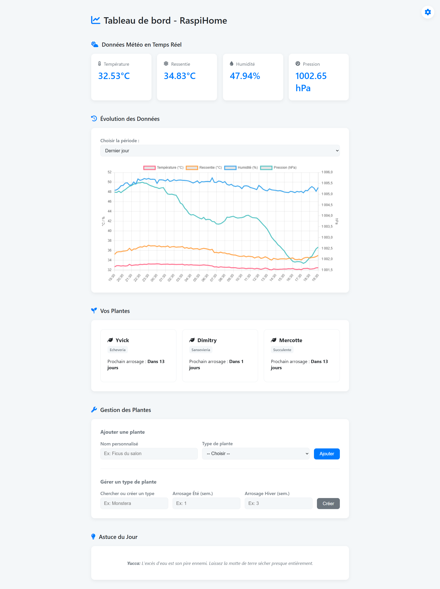
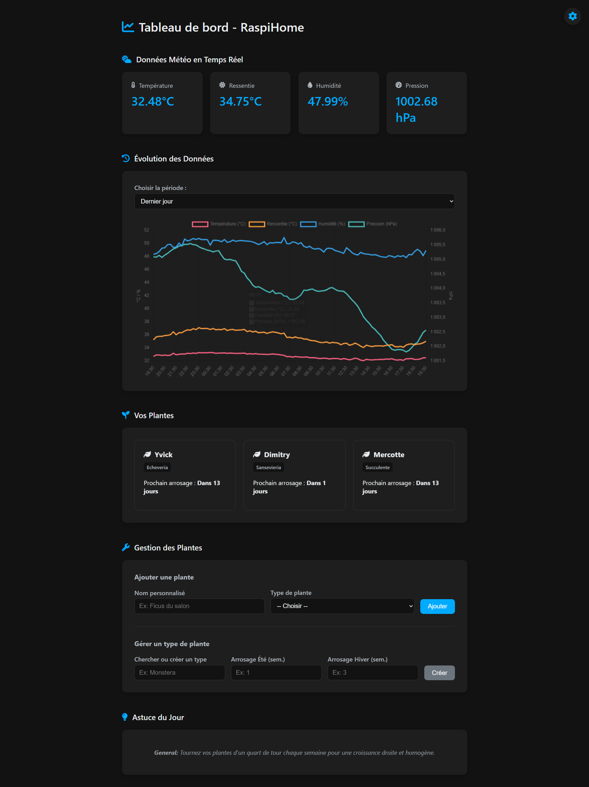

# RaspiHome Hub v3.0 : Météo Hybride, Jardinage Intelligent et Protection Réseau

<p align="center">
  
</p>

**RaspiHome Hub** transforme votre Raspberry Pi en un serveur domestique complet. Cette version majeure intègre une **station météo hybride** (données extérieures via API et intérieures via capteurs), un **assistant de jardinage proactif** avec historique, et une **interface utilisateur entièrement modernisée**,  avec un puissant bloqueur de publicités et de traqueurs pour tout votre réseau domestique grâce à AdGuard Home.

## Table des Matières
- [Fonctionnalités Clés](#fonctionnalités-clés)
- [Aperçu de l'Interface](#aperçu-de-linterface)
- [Architecture Technique v2.0](#architecture-technique-v20)
- [Prérequis](#prérequis)
- [Installation Facile](#installation-facile)
- [Guide d'Utilisation](#guide-dutilisation)
- [Structure du Projet](#structure-du-projet)
- [Personnalisation Avancée](#personnalisation-avancée)
- [Feuille de Route et Idées Futures](#feuille-de-route-et-idées-futures)
- [Contribuer](#contribuer)
- [Licence](#licence)

## Fonctionnalités Clés
### Station Météo & Jardinage Intelligent
*   📊 **Dashboard Météo en Temps Réel** : Affiche la température, l'humidité, la pression et un **indice de chaleur** calculé selon la formule de la NOAA.
*   🌐 **Intégration d'une API Météo** : Affiche la météo extérieure de votre localisation exacte.
*   📈 **Historique des Données** : Visualisez des graphiques dynamiques de l'évolution des conditions sur différentes périodes : heure, jour, semaine, mois et année.
*   🌗 **Thème Clair & Sombre** : Basculez entre deux thèmes visuels pour un confort de lecture optimal, de jour comme de nuit. Le choix est mémorisé.
*   💧 **Assistant de Jardinage Proactif** :
    *   **Base de Données de Plantes Centralisée** : Gère des centaines de types de plantes avec des règles d'arrosage personnalisées (été/hiver) dans une base de données **SQLite**.
    *   **Gestion Complète via l'Interface** : Plus besoin d'éditer des fichiers ! Recherchez, modifiez et créez de nouveaux types de plantes directement depuis le dashboard.
    *   **Conseils d'Entretien Contextuels** : Affiche une astuce aléatoire qui se focalise sur les plantes ayant besoin d'être arrosées.
    *   **Pop-up d'Informations** : Cliquez sur le type d'une de vos plantes pour obtenir une liste de conseils d'entretien spécifiques.
    *   **Importateur de Données via API** : Un script dédié permet d'enrichir la base de données de plantes en se connectant à l'API [Perenual](https://perenual.com/api/).
*  🎨 **Interface Utilisateur Moderne** :
    *   Nouvelle palette de couleurs et police "Poppins" pour un design professionnel.
    *   Interrupteur Jour/Nuit animé et mémorisé.
    *   Animations douces, transitions et effets de survol améliorés.
*   👆 **Fonctionnalités UX Avancées** :
    *   Barre de recherche pour filtrer dynamiquement vos plantes.
    *   Mode édition, historique et suppression directement sur les cartes de plantes.
    *   Recommandations intelligentes basées sur la météo.
*   🧩 **Code JavaScript Modulaire** : Le code frontend est maintenant éclaté en modules (`api.js`, `ui.js`, `main.js`) pour une meilleure maintenabilité.
*   ⚙️ **Déploiement en tant que Service** : Le projet peut désormais tourner en continu grâce à un service `systemd`.*   ⚙️ **Fonctionnement Autonome** : Le script utilise des threads pour enregistrer les données et gérer les alertes en arrière-plan, sans interrompre le serveur web.

### Protection Réseau avec AdGuard Home
*   ⛔ **Blocage des Publicités et Traqueurs** : Filtre le contenu indésirable sur tous les appareils de votre réseau.
*   🕵️ **Surveillance du Trafic** : Accédez à un tableau de bord détaillé pour voir les requêtes DNS.
*   🔒 **Sécurité Améliorée** : Protège contre les sites de phishing et de logiciels malveillants.

## Aperçu de l'Interface

L'interface a été entièrement repensée pour être plus claire, plus esthétique et plus fonctionnelle.

| Thème Clair | Thème Sombre |
| :---: | :---: |
|  |  |

## Architecture Technique v2.0

Le passage à la version 2.0 modernise l'architecture de stockage pour plus de robustesse et de performance :

1.  **Sources de Données** :
    *   **API OpenWeatherMap** : Fournit les données météo extérieures en temps réel pour une localisation précise.
    *   **Sense HAT** : Agit comme source de secours pour les données intérieures si l'API n'est pas disponible.
2.  **Script Python (`serveur_temp.py`)** :
    *   **Serveur Web (Flask)** : Expose de multiples routes API pour servir les données au frontend.
3.  **Stockage Centralisé (SQLite)** :
    *   **`raspihome.db`** : Une base de données unique qui stocke **toutes** les données : `plants`, `plant_rules`, `tips`, l'historique météo `sensor_readings`, et l'historique d'arrosage `watering_history`.
4.  **Interface Utilisateur (Modulaire)** :
    *   Une page web unique (`index.html`) et un CSS moderne (`style.css`).
    *   Logique JavaScript éclatée en modules : `api.js` (communications), `ui.js` (interface), `main.js` (orchestration).
5.  **Déploiement (`systemd`)** :
    *   Le serveur Flask est géré comme un service système, garantissant un lancement automatique et un redémarrage en cas de problème.

## Prérequis

### Matériel
*   Un Raspberry Pi (testé sur un modèle 1 B+)
*   Une carte d'extension [Sense HAT](https://www.raspberrypi.com/products/sense-hat/)
*   Une alimentation électrique fiable et une carte microSD.

### Logiciel
*   Python 3.x et Git.
*   Un compte et une **clé d'API** du service [OpenWeatherMap](https://openweathermap.org/) (le plan gratuit est suffisant).
*   Les bibliothèques Python listées dans `requirements.txt`.
*   Une installation d'AdGuard Home.

## Installation Facile

### Étape 1 : Installation de la Station Météo

1.  **Mettre à jour le système** :
    ```bash
    sudo apt update && sudo apt upgrade -y
    ```
2.  **Cloner ce dépôt** :
    ```bash
    git clone https://github.com/PlonoXxcoder/RaspiHome-Hub.git
    cd RaspiHome-Hub
    ```
3.  **Installer les dépendances système et Python** :
    ```bash
    sudo apt-get install python3-requests
    pip3 install -r requirements.txt
    ```
4.  **Initialiser la base de données** : Le script crée le fichier `raspihome.db` et le remplit avec une base de connaissance initiale.
    ```bash
    python3 database_setup.py
    ```

### Étape 2 : Installation d'AdGuard Home
*(Instructions à ajouter)*

## Guide d'Utilisation

### Démarrage du Serveur
1.  **Lancez l'application** depuis le dossier du projet :
    ```bash
    python3 serveur_temp.py
    ```
2.  **Accédez à l'interface web** en utilisant l'adresse IP de votre Raspberry Pi, sur le port 5000 (ou 5001 si vous êtes en mode test) : `http://<VOTRE_ADRESSE_IP>:5000`

### Gérer les Plantes
Toute la gestion se fait désormais via l'interface web, dans la section "Gestion des Plantes" :
*   **Ajouter une plante personnelle** : Donnez-lui un nom, choisissez son type dans la liste déroulante et cliquez sur "Ajouter".
*   **Gérer les types de plantes** :
    *   **Modifier** : Commencez à taper le nom d'un type existant. Les champs se rempliront automatiquement. Modifiez les valeurs et cliquez sur "Modifier".
    *   **Créer** : Tapez un nouveau nom, remplissez les semaines d'arrosage et cliquez sur "Créer".

## Structure du Projet
```.
├── templates/
│   ├── api.js           # Module JS pour les communications avec le serveur
│   ├── ui.js            # Module JS pour la manipulation de l'interface
│   ├── main.js          # Module JS principal (orchestration)
│   ├── index.html       # Structure de la page web
│   └── style.css        # Styles de la page
├── assets/              # Images pour le README
├── config.py            # Fichier de configuration (clés API, coordonnées)
├── database_setup.py    # Script d'initialisation de la base de données
├── raspihome.service    # Fichier de configuration pour le service systemd
├── requirements.txt     # Dépendances Python
├── serveur_temp.py      # Script principal (Backend Flask & Logique)
└── .gitignore           # Fichiers à ignorer par Git``

## Personnalisation Avancée

Ouvrez `serveur_temp.py` pour modifier :
*   **Les règles d'arrosage** dans le dictionnaire `PLANT_RULES`.
*   **L'intervalle d'enregistrement** dans la fonction `boucle_enregistrement()`.
*   **L'apparence de l'alerte LED** dans la fonction `boucle_gestion_alertes_led()`.

## Feuille de Route et Idées Futures

Ce projet a un grand potentiel d'évolution. Voici ce qui est prévu et ce qui pourrait être imaginé.

### 🚀 Prochaines Étapes (Feuille de Route)

Voici les fonctionnalités sur lesquelles nous travaillons activement pour les prochaines versions :

- **[ ] v1.1 : Améliorations de l'Interface et des données**
    - [X] Rendre les graphiques plus interactifs (zoom, info-bulles au survol).
    - [X] Ajouter un bouton "Rafraîchir maintenant" pour les données en temps réel.
    - [X] Afficher un indicateur visuel clair (ex: une icône de goutte d'eau) à côté des plantes qui ont besoin d'être arrosées.
    - [X] Ajouter une fonction de suppression de plante directement depuis l'interface.
    - [ ] Migrer l'historique météo (data.csv) vers la base de données SQLite pour des performances accrues.
          
  
- **[ ] v1.2 : Notifications Avancées**
    - [ ] Mettre en place un système de notifications par email ou via un bot Telegram pour les alertes critiques (plante à arroser, température trop haute/basse).
    - [ ] Permettre de configurer des seuils d'alerte pour la température et l'humidité.

- **[ ] v1.3 : Gestion des Plantes via l'UI**
    - [X] Créer un formulaire dans l'interface web pour ajouter, modifier ou supprimer une plante sans avoir à éditer le fichier `plants.json` manuellement.
    - [ ] Ajouter d'autres Raspberry afin de terminer chaque température et pression de chaque piece de la maison/appartement.
    - [ ] Controler l'humidité de la salle de bain afin de controller l'ouverture des fenetres pour l'aération


### 💡 Idées pour l'Avenir

Ces idées représentent des évolutions majeures qui pourraient être explorées. Toute aide est la bienvenue pour les concrétiser !

*   **Intégration de Capteurs d'Humidité du Sol** : La prochaine étape logique pour un arrosage véritablement intelligent. Les alertes ne seraient plus basées sur un calendrier, mais sur le besoin réel de la plante mesuré par un capteur capacitif.

*   **Système d'Arrosage Automatique** : Connecter une pompe à eau et un relais au Raspberry Pi pour que le système puisse non seulement alerter, mais aussi arroser les plantes de manière autonome.

*   **Intégration d'une API Météo** : Comparer les données intérieures avec les prévisions météorologiques extérieures. Le système pourrait, par exemple, suggérer de ne pas arroser si une journée très humide est annoncée.

*   **Base de Données de Plantes** : Créer une base de données plus complète où l'utilisateur pourrait choisir une plante dans une liste, et les règles d'arrosage (`PLANT_RULES`) seraient automatiquement appliquées.

*   **Support Multi-Capteurs** : Permettre de connecter plusieurs Raspberry Pi (ou des capteurs déportés type ESP32) et de centraliser toutes les données sur un seul dashboard.

## Contribuer

Les contributions sont le cœur de l'open-source ! Si vous avez des idées, des corrections de bugs ou de nouvelles fonctionnalités, n'hésitez pas à :
1.  Forker le projet.
2.  Créer une nouvelle branche (`git checkout -b feature/NouvelleFonctionnalite`).
3.  Faire vos modifications et les commiter.
4.  Soumettre une "Pull Request" en expliquant clairement vos changements.

## Licence

Ce projet est distribué sous la licence MIT. Voir le fichier `LICENSE` pour plus de détails.
